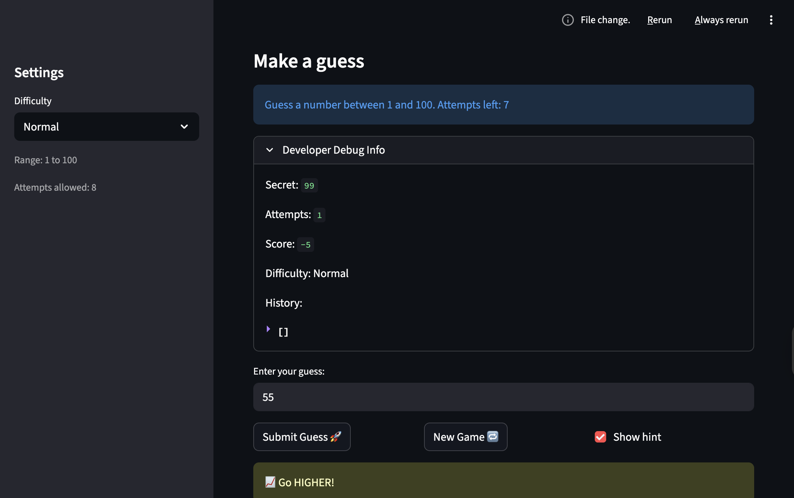
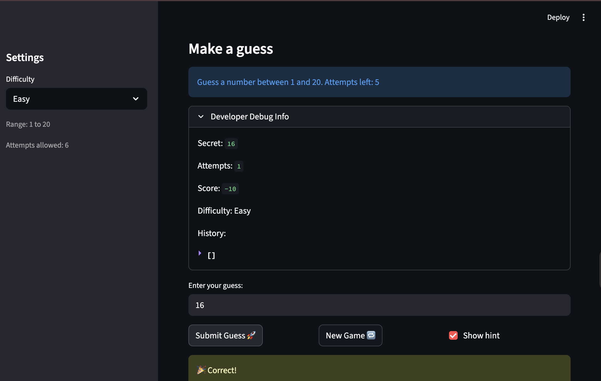

# 🎮 Game Glitch Investigator: The Impossible Guesser

## 🚨 The Situation

You asked an AI to build a simple "Number Guessing Game" using Streamlit.
It wrote the code, ran away, and now the game is unplayable. 

- You can't win.
- The hints lie to you.
- The secret number seems to have commitment issues.

## 🛠️ Setup

1. Install dependencies: `pip install -r requirements.txt`
2. Run the broken app: `python -m streamlit run app.py`

## 🕵️‍♂️ Your Mission

1. **Play the game.** Open the "Developer Debug Info" tab in the app to see the secret number. Try to win.
2. **Find the State Bug.** Why does the secret number change every time you click "Submit"? Ask ChatGPT: *"How do I keep a variable from resetting in Streamlit when I click a button?"*
3. **Fix the Logic.** The hints ("Higher/Lower") are wrong. Fix them.
4. **Refactor & Test.** - Move the logic into `logic_utils.py`.
   - Run `pytest` in your terminal.
   - Keep fixing until all tests pass!

## 📝 Document Your Experience

- [x] Describe the game's purpose. — A number guessing game where the player tries to guess a secret number within a set number of attempts, with difficulty levels that change the range and attempt limit.
- [x] Detail which bugs you found. — The hints were reversed (Too High said go higher, Too Low said go lower), the New Game button didn't reset status or history so the game got stuck after winning or losing, and changing difficulty had no effect on the range or attempts.
- [x] Explain what fixes you applied. — Swapped the Too High/Too Low hint messages, added a difficulty change detection block to fully reset game state, fixed the New Game button to reset all session state, and replaced hardcoded "1 and 100" with dynamic range variables.

## 📸 Demo

## 🚀 Stretch Features

- [ ] [If you choose to complete Challenge 4, insert a screenshot of your Enhanced Game UI here]
